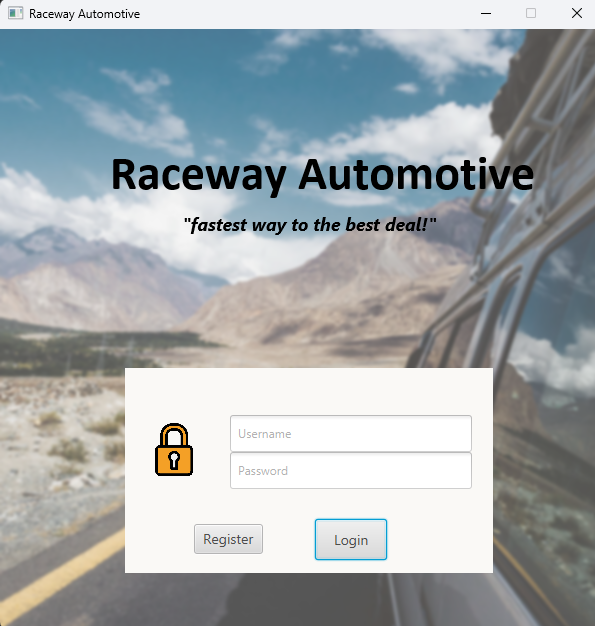
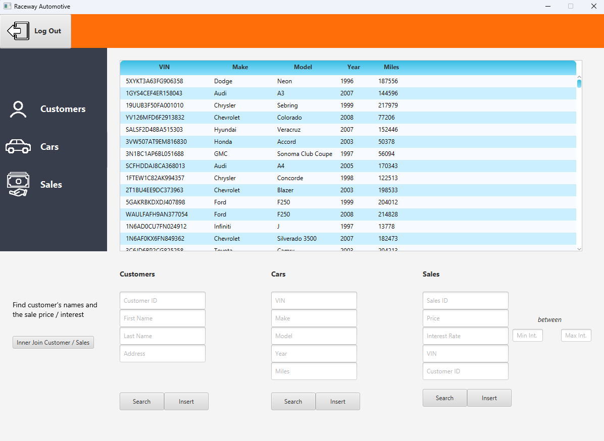
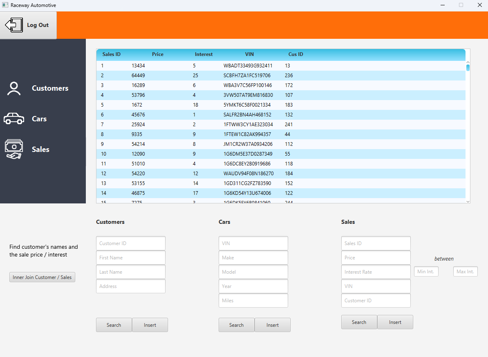

# Raceway Automotive - Dealership Management System

A comprehensive JavaFX-based dealership management application built with SQLite database integration. This system provides a complete solution for managing automotive dealership operations including customer records, vehicle inventory, sales tracking, and user authentication.

## 🚗 Overview

Raceway Automotive is a desktop application designed for automotive dealerships to streamline their daily operations. The system features an intuitive graphical interface that allows staff to efficiently manage customers, cars, and sales transactions through a centralized database system.

## ✨ Key Features

### 🔐 User Authentication System
- **User Registration**: New users can create accounts with username and password
- **Secure Login**: Authentication system with credential validation
- **Session Management**: Secure access to the main application features



### 👥 Customer Management
- **Add New Customers**: Register customer information including name and address
- **Search Customers**: Find customers by ID, first name, last name, or address
- **View Customer Records**: Display all customer information in organized table format
- **Customer Validation**: Ensures no null values are entered


### 🚙 Vehicle Inventory Management
- **Add Vehicles**: Register new cars with VIN, make, model, year, and mileage
- **Search Inventory**: Search cars by VIN, make, model, year, or mileage
- **Vehicle Details**: Comprehensive vehicle information display
- **Inventory Overview**: View all vehicles in organized table format



### 💰 Sales Transaction Management
- **Record Sales**: Create new sales records linking customers to vehicles
- **Sales Search**: Advanced search by sales ID, price, interest rate, VIN, or customer ID
- **Interest Rate Filtering**: Search sales within specific interest rate ranges
- **Transaction Tracking**: Complete sales history with detailed information



### 📊 Advanced Reporting
- **Customer-Sales Integration**: Inner join reports showing customer purchase history
- **Data Relationships**: View connections between customers, cars, and sales
- **Comprehensive Reports**: Generate detailed business intelligence reports


## 🛠 Technical Specifications

### Architecture
- **Frontend**: JavaFX with FXML for UI design
- **Backend**: Java 17 with JDBC connectivity
- **Database**: SQLite for data persistence
- **Build Tool**: Maven for dependency management
- **Design Pattern**: MVC (Model-View-Controller) architecture

### Database Schema
The application uses four main database tables:

#### Users Table
- `user_name` (VARCHAR): Username for authentication
- `user_password` (VARCHAR): User password

#### Customers Table
- `cus_id` (INTEGER): Primary key, auto-increment
- `cus_fname` (VARCHAR): Customer first name
- `cus_lname` (VARCHAR): Customer last name
- `cus_address` (VARCHAR): Customer address

#### Cars Table
- `cars_vin` (VARCHAR): Vehicle identification number (Primary key)
- `cars_make` (VARCHAR): Car manufacturer
- `cars_model` (VARCHAR): Car model
- `cars_year` (INTEGER): Manufacturing year
- `cars_miles` (INTEGER): Mileage

#### Sales Table
- `sales_id` (INTEGER): Primary key, auto-increment
- `sales_price` (INTEGER): Sale price
- `sales_intrate` (INTEGER): Interest rate
- `cars_vin` (VARCHAR): Foreign key to Cars table
- `cus_id` (INTEGER): Foreign key to Customers table

### Dependencies
- **JavaFX Controls & FXML**: UI framework and layout management
- **SQLite JDBC Driver**: Database connectivity
- **JUnit Jupiter**: Testing framework (5.7.1)

## 🚀 Getting Started

### Prerequisites
- Java 17 or higher
- Maven 3.6+
- JavaFX runtime (included in dependencies)

### Installation & Setup

1. **Clone the Repository**
   ```bash
   git clone <repository-url>
   cd Dealership-Database-Application
   ```

2. **Build the Application**
   ```bash
   mvn clean compile
   ```

3. **Run the Application**
   ```bash
   mvn javafx:run
   ```

### First Run Setup
1. Launch the application - you'll see the login screen
2. Register a new user account using the "Register" button
3. Login with your credentials to access the main dashboard
4. The SQLite database will be automatically created in the resources folder

*[Screenshot Placeholder: First-time setup process]*

## 🎯 Usage Guide

### Main Dashboard Navigation
The main dashboard provides easy access to all system features through a sidebar navigation:

- **Customers Button**: Access customer management features
- **Cars Button**: Manage vehicle inventory
- **Sales Button**: Handle sales transactions
- **Inner Join Report**: Generate customer-sales reports

*[Screenshot Placeholder: Main dashboard with sidebar navigation]*

### Adding Data
1. **Adding Customers**: Fill in first name, last name, and address fields, then click "Insert Customer"
2. **Adding Vehicles**: Enter VIN, make, model, year, and mileage, then click "Insert Car"
3. **Recording Sales**: Input price, interest rate, VIN, and customer ID, then click "Insert Sale"

### Searching Data
Each section provides flexible search capabilities:
- Use any combination of search fields
- Leave fields blank to search all records
- Results display in the main table view
- Clear validation messages guide proper usage

*[Screenshot Placeholder: Search functionality demonstration]*

## 🔧 System Requirements

### Minimum Requirements
- **OS**: Windows 10, macOS 10.15, or Linux (Ubuntu 18.04+)
- **Memory**: 4GB RAM
- **Storage**: 100MB available space
- **Java**: Java 17 Runtime Environment

### Recommended Requirements
- **OS**: Latest versions of Windows, macOS, or Linux
- **Memory**: 8GB RAM
- **Storage**: 500MB available space
- **Java**: Java 17+ JDK for development

## 📁 Project Structure

```
Dealership-Database-Application/
├── src/
│   └── main/
│       ├── java/com/example/loginapplication/
│       │   ├── App.java                    # Main application class
│       │   ├── DatabaseSQLiteController.java # Login controller
│       │   ├── afterLogin.java            # Main dashboard controller
│       │   ├── Cars.java                  # Car model class
│       │   ├── Customers.java             # Customer model class
│       │   ├── Sales.java                 # Sales model class
│       │   └── CustomerSales.java         # Customer-Sales join model
│       └── resources/com/example/loginapplication/
│           ├── DatabaseSQLite.fxml        # Login screen layout
│           ├── afterLogin.fxml            # Main dashboard layout
│           ├── styles.css                 # Application styles
│           ├── Dealership.db              # SQLite database
│           └── *.png                      # UI images and icons
├── pom.xml                                # Maven configuration
└── README.md                              # This file
```

## 🎨 User Interface Features

### Visual Design
- **Modern Interface**: Clean, professional design suitable for business use
- **Intuitive Navigation**: Sidebar navigation with clear icons and labels
- **Responsive Layout**: Adapts to different screen sizes and resolutions
- **Visual Feedback**: Success and error messages guide user actions

*[Screenshot Placeholder: UI design showcase]*

### Data Validation
- **Input Validation**: Prevents null values and invalid data entry
- **Real-time Feedback**: Immediate validation messages
- **Error Handling**: Graceful handling of database errors and connection issues
- **Data Integrity**: Maintains referential integrity across database tables

## 🔒 Security Features

- **User Authentication**: Secure login system with password protection
- **Input Sanitization**: Prepared statements prevent SQL injection attacks
- **Session Management**: Secure session handling throughout the application
- **Database Security**: SQLite database with proper access controls


## 📝 License

This project is created for educational and demonstration purposes. Please ensure compliance with any applicable licenses when using or modifying this software.

## 🤝 Contributing

This is a demonstration project showcasing dealership management system capabilities. The codebase provides a solid foundation for further development and customization based on specific business requirements.

---

**Raceway Automotive** - Streamlining dealership operations through modern software solutions.
